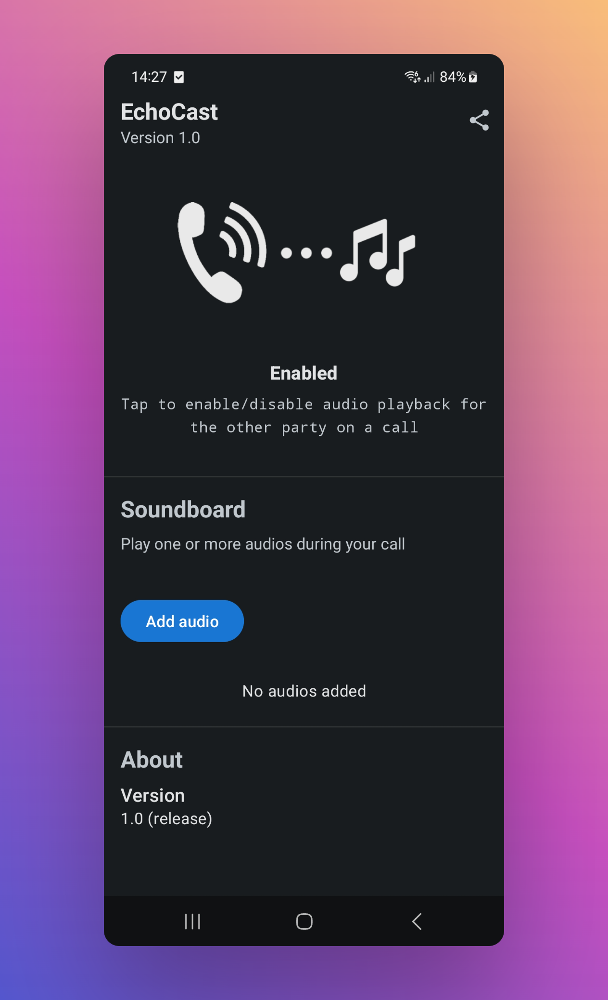

# 🎧 EchoCast


EchoCast is an Android application that plays audio files to the other party during phone calls. It allows you to play sounds, music, or voice recordings to the person you're talking to without having to hold your phone to a speaker.

## ✨ Features

- Play audio files during active phone calls
- Simple and intuitive user interface
- Soundboard functionality for multiple audio clips
- Quick settings tile for easy access
- Works on devices with telephony audio output support

## 📋 Requirements

- Android 9.0 (API 28) or higher
- Device with telephony audio output support (most modern Android phones)
- Root access (via Magisk) or custom ROM installation capabilities

## 📥 Installation

EchoCast requires system-level permissions to function properly, so it must be installed as a system app:

### 🔧 For Rooted Devices (Magisk)

1. Download the latest EchoCast zip file from the [releases page](https://github.com/rudisec/EchoCast/releases)
2. Open Magisk Manager
3. Tap on Modules → Install from storage
4. Select the EchoCast zip file
5. Reboot your device
6. Open EchoCast from your app drawer

## 📱 Usage

1. Open EchoCast
2. Enable call playback by toggling the switch
3. Add audio files to your soundboard
4. When you receive or make a call, the audio will be played to the other party

## 📸 Screenshots

<div align="center">
  
  
</div>

## ⚙️ How It Works

EchoCast uses Android's InCallService API to detect active phone calls. When a call is detected, it uses the `MODIFY_PHONE_STATE` privileged system permission to create an `AudioTrack` instance for the telephony output device, allowing it to play audio directly to the call.

## 🛠️ Building from Source

EchoCast can be built using Android Studio or the Gradle command line:

```bash
# To build the APK
./gradlew assembleDebug

# To build the Magisk module zip
./gradlew zipDebug
```

The output files will be in `app/build/distributions/debug/`.

## 📱 Compatible Devices

This application has been tested and confirmed to work on the following devices:

| Device | Android Version | Status |
|--------|----------------|--------|
| Samsung Galaxy A52s 5G | Android 13 | ✅ Works correctly |

*Do you have EchoCast working on your device? Let us know to add it to this list!*

## 📜 License

EchoCast is free software: you can redistribute it and/or modify it under the terms of the GNU General Public License as published by the Free Software Foundation, either version 3 of the License, or (at your option) any later version.

This program is distributed in the hope that it will be useful, but WITHOUT ANY WARRANTY; without even the implied warranty of MERCHANTABILITY or FITNESS FOR A PARTICULAR PURPOSE. See the GNU General Public License for more details.

You should have received a copy of the GNU General Public License along with this program. If not, see <https://www.gnu.org/licenses/>.

## 👏 Acknowledgments

EchoCast is based on [Basic Call Player (BCP)](https://github.com/chenxiaolong/BCP) by chenxiaolong, which is licensed under GPL-3.0. This fork is maintained at [https://github.com/rudisec/EchoCast](https://github.com/rudisec/EchoCast).
